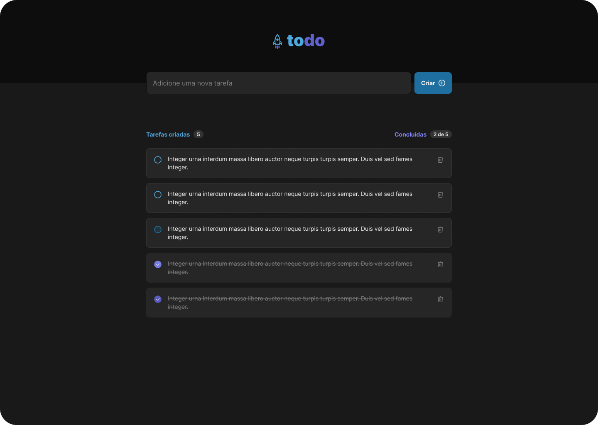

# Desafio - Rocketseat Ignite 2022 - React

## 👨‍💻 Sobre este repositório

Esse repositório contém uma pequena aplicação de lista de tarefas.

O projeto é parte dos execícios da nova atualização do curso Ignite da Rocketseat e faz parte da trilha de React. Nesse desafio o objetivo é praticar os fundamentos do React trabalhando com estados e estrutura de dados da aplicação, além de utilizar CSS Modules.

----

## 💻 Sobre o desafio
Esse desafio faz parte dos exercícios fundamentais para a formação no curso. Ele faz parte de uma linha de aprendizagem contínua que permite que o aluno construa o conhecimento com base nas experiências vividas em cada projeto construído dentro de cada módulo.
